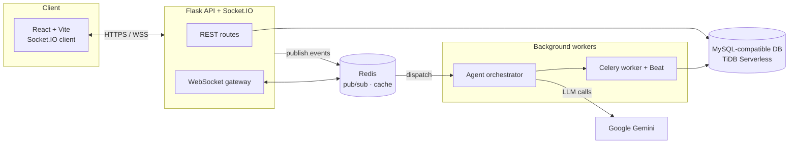

<div align="center">

# AuraFlow

**A real-time community platform with an autonomous multi-agent AI layer.**

AuraFlow blends Discord-style communities, channels, and direct messaging with a system of
background AI agents that moderate conversations, track community mood, translate messages
inline, and proactively support members — all in real time.


</div>

---

## Table of Contents

- [Overview](#overview)
- [Key Features](#key-features)
- [The Autonomous Agent System](#the-autonomous-agent-system)
- [Tech Stack](#tech-stack)
- [Architecture](#architecture)
- [Project Structure](#project-structure)
- [Getting Started](#getting-started)
- [Environment Variables](#environment-variables)
- [Running the Full Stack](#running-the-full-stack)
- [Testing](#testing)
- [Deployment](#deployment)

---

## Overview

AuraFlow is a full-stack, real-time messaging platform organized around **communities** and
**channels**, with direct messages, friends, reactions, pins, search, and push notifications.

What sets it apart is its **autonomous agent layer**: a set of AI agents that observe platform
activity through a Redis-backed event bus and act on their own initiative — flagging harmful
content, checking in on users showing signs of distress, summarizing busy channels, translating
messages per-viewer, and keeping communities engaged. Each agent follows a
**Sense → Think → Act → Learn** lifecycle and can be tuned or disabled per community.

The platform ships with role-aware **admin** and **system-admin** dashboards for community
health, mood trends, engagement analytics, flagged content, agent configuration, and audit logs.

## Key Features

- **Real-time messaging** — communities, channels, and DMs over WebSockets (Socket.IO) with
  presence, typing indicators, reactions, pins, and unread tracking.
- **Autonomous AI agents** — moderation, wellness check-ins, mood tracking, inline translation,
  engagement nudges, summarization, and a support assistant (see below).
- **Per-viewer inline translation** — messages are translated on demand for each viewer,
  including a Roman-Urdu → Urdu transliteration bridge for accurate results.
- **Authentication & sessions** — JWT access/refresh tokens, email verification, OTP, password
  reset, and multi-session management.
- **Admin & system-admin consoles** — community management, user management, mood trends,
  engagement analytics, flagged content review, agent goals/settings, and audit logging.
- **Notifications** — in-app plus Web Push (VAPID) and batched email notifications.
- **Production-ready ops** — Celery workers and Beat for background/scheduled jobs, Redis for
  pub/sub and caching, Gunicorn + gevent for serving.

## The Autonomous Agent System

Agents subscribe to topics on a Redis event bus and are dispatched by a central
**orchestrator**. Instances are created lazily on first matching event, so importing the
registry stays free of heavy ML dependencies.

| Agent | Responsibility |
| --- | --- |
| **Moderation** | Detects and flags harmful or policy-violating content. |
| **Wellness** | Sends private check-ins when a user shows signs of distress (cross-process deduplicated). |
| **Mood Tracker** | Analyzes sentiment to surface community mood trends. |
| **Translator** | Per-viewer inline translation with Roman-Urdu transliteration support. |
| **Engagement** | Nudges quiet channels and encourages participation. |
| **Summarizer** | Condenses busy channels into digestible summaries. |
| **Support / Assistant** | Answers member questions from a knowledge base. |
| **Knowledge Builder** | Builds and maintains the support knowledge base. |
| **Auto Message / Focus** | Welcome flows and focus/attention helpers. |

The lifecycle, defined in [`Backend/agents/base.py`](Backend/agents/base.py):

```
sense(event)  → observation        # cheap, no LLM call
    ↓
decide(obs)   → (action, payload)  # every cycle is logged
    ↓
act(payload)                       # only when the agent chooses to act
    ↓
learn(action_id, signal)           # feedback adjusts thresholds over time
```

## Tech Stack

**Backend**
- Python 3.12, Flask, Flask-SocketIO, Flask-JWT-Extended, Flask-CORS, Flask-Compress
- Celery + Redis (task queue, scheduling, pub/sub event bus)
- PyMySQL over a MySQL-compatible database (TiDB Serverless) with a pooled connection
- Google Gemini (`google-genai`) plus NLTK / scikit-learn / spaCy / TextBlob for NLP
- Gunicorn + gevent (production), Web Push (`pywebpush`), SMTP email/OTP

**Frontend**
- React 18 + TypeScript + Vite
- Tailwind CSS with shadcn/ui (Radix UI primitives)
- TanStack Query, Zustand, React Router, Socket.IO client
- Recharts and react-force-graph for analytics and knowledge-graph views

## Architecture



## Project Structure

```
AuraFlow/
├── Backend/                 # Flask API, Socket.IO, Celery, AI agents
│   ├── agents/              # Autonomous agents + orchestrator + event bus
│   ├── routes/              # REST + socket route handlers
│   ├── services/            # Redis, presence, email, notifications, sessions
│   ├── tasks/               # Celery tasks (agents, email, orchestrator)
│   ├── migrations/          # SQL schema and migrations
│   ├── tests/               # Unit / integration / system / UAT suites
│   ├── app.py               # Dev entry point
│   ├── wsgi.py              # Production entry point (gevent monkey-patch)
│   ├── celery_app.py        # Celery configuration
│   └── requirements.txt
├── Frontend/                # React + TypeScript + Vite client
│   └── src/
│       ├── pages/           # App pages + admin & system-admin consoles
│       ├── components/      # UI components (shadcn/ui)
│       └── ...
└── README.md
```

## Getting Started

### Prerequisites

- **Python 3.12+**
- **Node.js 18+** and npm
- **Redis** (required for Celery, the event bus, and caching)
- A **MySQL-compatible database** (e.g. TiDB Serverless or MySQL 8)
- A **Google Gemini API key** for AI features

### 1. Backend

```powershell
cd Backend
python -m venv venv
.\venv\Scripts\Activate.ps1        # macOS/Linux: source venv/bin/activate
python -m pip install --upgrade pip
pip install -r requirements.txt
```

Create a `Backend/.env` file (see [Environment Variables](#environment-variables)), then run:

```powershell
python app.py
```

The API starts at `http://127.0.0.1:5000`.

### 2. Frontend

```powershell
cd Frontend
npm install
npm run dev
```

The client starts at `http://localhost:5173`.

## Environment Variables

Create `Backend/.env`:

```dotenv
# Environment
FLASK_ENV=development

# Database (MySQL-compatible / TiDB Serverless)
DB_HOST=your-db-host
DB_USER=your-db-user
DB_PASSWORD=your-db-password
DB_NAME=auraflow
DB_PORT=3306

# Auth
JWT_SECRET_KEY=change-me-in-production
JWT_REFRESH_TOKEN_EXPIRES_DAYS=7

# AI
GEMINI_API_KEY=your-gemini-api-key

# Cache / queue
REDIS_URL=redis://localhost:6379/0

# CORS (production)
FRONTEND_URL=http://localhost:5173

# Email / OTP
SMTP_SERVER=smtp.gmail.com
SMTP_PORT=465
SMTP_EMAIL=your-email@example.com
SMTP_APP_PASSWORD=your-app-password

# Web Push (optional) — generate a VAPID key pair
VAPID_PUBLIC_KEY=
VAPID_PRIVATE_KEY=
VAPID_CLAIMS_EMAIL=mailto:admin@auraflow.app
```

Create `Frontend/.env` (or `.env.production` for builds):

```dotenv
VITE_BACKEND_URL=http://127.0.0.1:5000
```

## Running the Full Stack

AuraFlow's background agents and scheduled jobs run through Celery and Redis. For the full
experience, run each of the following in its own terminal (with the venv activated and Redis up).

**1 — API server**
```powershell
cd Backend
python app.py
```

**2 — Frontend**
```powershell
cd Frontend
npm run dev
```

**3 — Celery worker** (agents & background jobs)
```powershell
cd Backend
python -m celery -A celery_app worker --loglevel=info --pool=solo
```

**4 — Celery Beat** (scheduled jobs)
```powershell
cd Backend
python -m celery -A celery_app beat --loglevel=info
```

> Redis must be running before starting Celery. Stop any service with `Ctrl+C`.

## Testing

**Backend** — suites live under `Backend/tests/` (`UNIT_TESTING`, `INTEGRATION_TESTING`,
`SYSTEM_TESTING`, `UAT`):

```powershell
cd Backend
python -m pytest
```

**Frontend** — Vitest:

```powershell
cd Frontend
npx vitest run
```

## Deployment

- **Backend** deploys to [Render](https://render.com) via
  [`Backend/render.yaml`](Backend/render.yaml) (Gunicorn + gevent, `wsgi.py` entry point).
- **Frontend** deploys to [Vercel](https://vercel.com) via
  [`Frontend/vercel.json`](Frontend/vercel.json) (Vite static build with SPA rewrites).

Set the environment variables above in each platform's dashboard, and point
`VITE_BACKEND_URL` at the deployed backend URL.

---

<div align="center">
Built as a Final Year Project.
</div>
