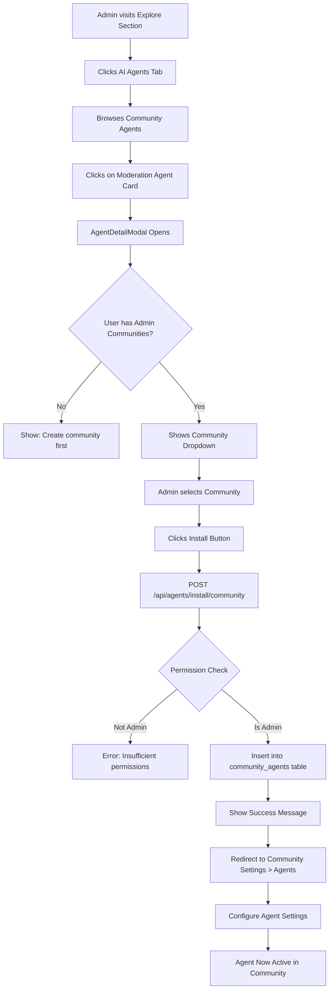
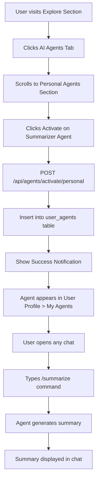
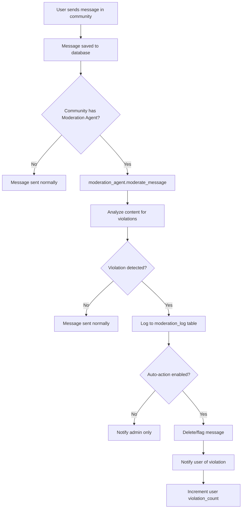

# 🤖 AuraFlow Agent Integration Architecture

**Version:** 1.0  
**Last Updated:** February 22, 2026  
**Status:** Implementation Ready

---

## 📋 Table of Contents

1. [Overview](#overview)
2. [Agent Classification](#agent-classification)
3. [System Architecture](#system-architecture)
4. [User Flow Diagrams](#user-flow-diagrams)
5. [Database Schema](#database-schema)
6. [Backend Implementation](#backend-implementation)
7. [Frontend Implementation](#frontend-implementation)
8. [Integration Points](#integration-points)
9. [Permission Matrix](#permission-matrix)
10. [Testing Scenarios](#testing-scenarios)

---

## 🎯 Overview

AuraFlow features **7 AI-powered agents** that enhance communication through intelligent automation. This document outlines the complete architecture for agent discovery, installation, configuration, and execution within the platform.

### Key Principles

✅ **User-Centric Discovery** - All agent interactions start from the Explore section  
✅ **Role-Based Access Control** - Community agents require admin permissions  
✅ **Flexible Configuration** - Per-community and per-user agent settings  
✅ **Event-Driven Execution** - Agents trigger automatically based on chat activity  
✅ **Transparent Operations** - Users always know when agents are active

---

## 🏷️ Agent Classification

### Community-Level Agents (Admin-Controlled)

These agents are installed by community **owners/admins** and work for all community members.

| Agent | Icon | Purpose | Auto-Execution |
|-------|------|---------|----------------|
| **Moderation Agent** | 🛡️ | Auto-moderate toxic content, spam, and violations | ✅ On every message |
| **Engagement Agent** | 🎯 | Boost activity with polls, challenges, icebreakers | ✅ On inactivity detection |
| **Knowledge Builder** | 📚 | Extract Q&A pairs and build searchable knowledge base | ⚙️ Manual or scheduled |
| **Focus Agent** | 🎯 | Monitor conversation focus and detect topic drift | ⚙️ Every N messages |

**Access Pattern:**
```
Community Owner/Admin → Explore → Select Agent → Choose Community → Install → Configure
```

---

### Personal-Level Agents (User-Controlled)

These agents are activated by individual users and work across all their chats.

| Agent | Icon | Purpose | Trigger Method |
|-------|------|---------|----------------|
| **Summarizer Agent** | 📝 | Generate conversation summaries in any chat | 🎮 Command: `/summarize` |
| **Mood Tracker** | 😊 | Track emotional tone with Roman Urdu support | ✅ Auto-analyzes user's messages |
| **Wellness Agent** | 🧘 | Provide wellness suggestions based on activity | ⚙️ Periodic checks |

**Access Pattern:**
```
User → Explore → Select Personal Agent → Activate → Use via commands/auto
```

---

## 🏗️ System Architecture

### High-Level Component Diagram

```
┌─────────────────────────────────────────────────────────────────┐
│                         FRONTEND (React)                        │
├─────────────────────────────────────────────────────────────────┤
│                                                                 │
│  ┌──────────────────┐    ┌──────────────────┐                 │
│  │  Explore Section │    │ Community Settings│                 │
│  │  - AI Agents Tab │───▶│  - Agents Tab     │                 │
│  │  - Discovery     │    │  - Configuration  │                 │
│  └──────────────────┘    └──────────────────┘                 │
│           │                        │                             │
│           ▼                        ▼                             │
│  ┌──────────────────────────────────────────┐                  │
│  │      AgentDetailModal                    │                  │
│  │      AgentSettingsModal                  │                  │
│  └──────────────────────────────────────────┘                  │
│           │                        │                             │
│           ▼                        ▼                             │
│  ┌──────────────────────────────────────────┐                  │
│  │       AIAgentContext Provider            │                  │
│  └──────────────────────────────────────────┘                  │
│                        │                                         │
└────────────────────────┼─────────────────────────────────────────┘
                         │ REST API + WebSocket
┌────────────────────────┼─────────────────────────────────────────┐
│                        ▼          BACKEND (Flask)                │
├─────────────────────────────────────────────────────────────────┤
│                                                                 │
│  ┌──────────────────────────────────────────────────────────┐  │
│  │              Agent Management Routes                      │  │
│  │  /api/agents/catalog                                      │  │
│  │  /api/agents/install/community/<id>                       │  │
│  │  /api/agents/configure/community/<id>/<type>              │  │
│  │  /api/agents/activate/personal                            │  │
│  └──────────────────────────────────────────────────────────┘  │
│                        │                                         │
│           ┌────────────┼────────────┐                            │
│           ▼            ▼            ▼                            │
│  ┌──────────────┐ ┌──────────────┐ ┌──────────────┐            │
│  │ Permission   │ │ Agent        │ │ Settings     │            │
│  │ Validator    │ │ Registry     │ │ Manager      │            │
│  └──────────────┘ └──────────────┘ └──────────────┘            │
│           │            │            │                            │
│           └────────────┼────────────┘                            │
│                        ▼                                         │
│  ┌─────────────────────────────────────────────────────────┐   │
│  │              Agent Instances                             │   │
│  │  - moderation_agent    - engagement_agent                │   │
│  │  - summarizer_agent    - mood_tracker_agent              │   │
│  │  - wellness_agent      - knowledge_builder_agent         │   │
│  │  - focus_agent                                           │   │
│  └─────────────────────────────────────────────────────────┘   │
│                        │                                         │
└────────────────────────┼─────────────────────────────────────────┘
                         │
┌────────────────────────┼─────────────────────────────────────────┐
│                        ▼          DATABASE (MySQL)               │
├─────────────────────────────────────────────────────────────────┤
│                                                                 │
│  ┌─────────────────┐  ┌──────────────────┐  ┌───────────────┐  │
│  │ agent_registry  │  │ community_agents │  │  user_agents  │  │
│  │ (metadata)      │  │ (installations)  │  │ (activations) │  │
│  └─────────────────┘  └──────────────────┘  └───────────────┘  │
│                                                                 │
│  ┌──────────────────────────────────────────────────────────┐  │
│  │              Agent Data Tables                            │  │
│  │  - moderation_log      - engagement_metrics               │  │
│  │  - conversation_summaries  - mood_tracking                │  │
│  │  - wellness_tracking   - knowledge_base                   │  │
│  └──────────────────────────────────────────────────────────┘  │
└─────────────────────────────────────────────────────────────────┘
```

---

## 🔄 User Flow Diagrams

### Flow 1: Installing Community Agent (Admin)



### Flow 2: Activating Personal Agent



### Flow 3: Agent Auto-Execution (Moderation Example)



---

## 🗄️ Database Schema

### Core Tables

#### 1. `agent_registry` (Agent Metadata)

```sql
CREATE TABLE agent_registry (
    agent_type VARCHAR(50) PRIMARY KEY,
    display_name VARCHAR(100) NOT NULL,
    description TEXT NOT NULL,
    category ENUM('community', 'personal') NOT NULL,
    requires_role ENUM('owner', 'admin', 'member') NOT NULL,
    icon VARCHAR(50),
    default_settings JSON,
    is_active BOOLEAN DEFAULT TRUE,
    created_at TIMESTAMP DEFAULT CURRENT_TIMESTAMP
);
```

**Sample Data:**
```sql
INSERT INTO agent_registry VALUES
('moderation', 'Moderation Agent', 'Auto-moderate toxic content and spam with Roman Urdu support', 
 'community', 'admin', '🛡️', 
 '{"sensitivity": "medium", "auto_action": false, "roman_urdu": true}', TRUE, NOW()),

('engagement', 'Engagement Agent', 'Boost community activity with polls, challenges, and icebreakers', 
 'community', 'admin', '🎯', 
 '{"auto_suggestions": true, "frequency": "low", "activity_types": ["polls", "icebreakers"]}', TRUE, NOW()),

('summarizer', 'Summarizer Agent', 'Generate conversation summaries in any chat', 
 'personal', 'member', '📝', 
 '{"style": "bullet_points", "length": "medium", "max_messages": 100}', TRUE, NOW());
```

#### 2. `community_agents` (Installation Records)

```sql
CREATE TABLE community_agents (
    id INT AUTO_INCREMENT PRIMARY KEY,
    community_id INT NOT NULL,
    agent_type VARCHAR(50) NOT NULL,
    enabled BOOLEAN DEFAULT TRUE,
    settings JSON,  -- Overrides default_settings from agent_registry
    installed_by INT NOT NULL,
    installed_at TIMESTAMP DEFAULT CURRENT_TIMESTAMP,
    last_active TIMESTAMP,
    usage_count INT DEFAULT 0,
    FOREIGN KEY (community_id) REFERENCES communities(id) ON DELETE CASCADE,
    FOREIGN KEY (agent_type) REFERENCES agent_registry(agent_type),
    FOREIGN KEY (installed_by) REFERENCES users(id),
    UNIQUE KEY unique_community_agent (community_id, agent_type),
    INDEX idx_community_enabled (community_id, enabled),
    INDEX idx_agent_type (agent_type)
);
```

**Example Record:**
```json
{
  "id": 1,
  "community_id": 42,
  "agent_type": "moderation",
  "enabled": true,
  "settings": {
    "sensitivity": "high",
    "auto_action": true,
    "roman_urdu": true,
    "blocked_words": ["custom", "word", "list"]
  },
  "installed_by": 123,
  "installed_at": "2026-02-22T10:30:00Z",
  "last_active": "2026-02-22T14:25:00Z",
  "usage_count": 247
}
```

#### 3. `user_agents` (Personal Agent Activations)

```sql
CREATE TABLE user_agents (
    id INT AUTO_INCREMENT PRIMARY KEY,
    user_id INT NOT NULL,
    agent_type VARCHAR(50) NOT NULL,
    enabled BOOLEAN DEFAULT TRUE,
    settings JSON,
    activated_at TIMESTAMP DEFAULT CURRENT_TIMESTAMP,
    last_used TIMESTAMP,
    usage_count INT DEFAULT 0,
    FOREIGN KEY (user_id) REFERENCES users(id) ON DELETE CASCADE,
    FOREIGN KEY (agent_type) REFERENCES agent_registry(agent_type),
    UNIQUE KEY unique_user_agent (user_id, agent_type),
    INDEX idx_user_enabled (user_id, enabled)
);
```

**Example Record:**
```json
{
  "id": 1,
  "user_id": 456,
  "agent_type": "summarizer",
  "enabled": true,
  "settings": {
    "style": "bullet_points",
    "length": "short",
    "auto_notify": true
  },
  "activated_at": "2026-02-20T09:15:00Z",
  "last_used": "2026-02-22T14:30:00Z",
  "usage_count": 15
}
```

### Relationships Diagram

```
┌─────────────────┐
│  agent_registry │
│  (7 agents)     │
└────────┬────────┘
         │
         │ Referenced by
         │
    ┌────┴────────────────────┐
    │                         │
    ▼                         ▼
┌──────────────────┐    ┌──────────────┐
│ community_agents │    │ user_agents  │
│ (installations)  │    │ (activations)│
└────────┬─────────┘    └──────┬───────┘
         │                     │
         │ References          │ References
         │                     │
         ▼                     ▼
┌─────────────────┐    ┌──────────────┐
│   communities   │    │    users     │
│                 │    │              │
└─────────────────┘    └──────────────┘
```

---

## ⚙️ Backend Implementation

### New API Endpoints

#### **File:** `Backend/routes/agents.py`

```python
from flask import Blueprint, jsonify, request
from flask_jwt_extended import jwt_required, get_jwt_identity
from database import get_db_connection
from utils import require_community_admin

agents_bp = Blueprint('agents', __name__)

# ==================== AGENT CATALOG ====================

@agents_bp.route('/catalog', methods=['GET'])
@jwt_required()
def get_agent_catalog():
    """
    Get all available agents with installation status
    
    Response:
    {
      "success": true,
      "agents": {
        "community": [
          {
            "agent_type": "moderation",
            "display_name": "Moderation Agent",
            "description": "...",
            "icon": "🛡️",
            "requires_role": "admin",
            "default_settings": {...},
            "user_communities_with_agent": [1, 5, 12]  // communities where user has this installed
          }
        ],
        "personal": [
          {
            "agent_type": "summarizer",
            "display_name": "Summarizer Agent",
            "description": "...",
            "icon": "📝",
            "is_activated": true,  // for current user
            "usage_count": 15
          }
        ]
      }
    }
    """
    try:
        user_id = get_jwt_identity()
        conn = get_db_connection()
        cursor = conn.cursor(dictionary=True)
        
        # Get all agents from registry
        cursor.execute("SELECT * FROM agent_registry WHERE is_active = TRUE ORDER BY category, agent_type")
        all_agents = cursor.fetchall()
        
        # Get user's owned/admin communities
        cursor.execute("""
            SELECT community_id FROM community_members 
            WHERE user_id = %s AND role IN ('owner', 'admin')
        """, (user_id,))
        admin_communities = [row['community_id'] for row in cursor.fetchall()]
        
        # Get community agents for user's communities
        if admin_communities:
            placeholders = ','.join(['%s'] * len(admin_communities))
            cursor.execute(f"""
                SELECT community_id, agent_type FROM community_agents 
                WHERE community_id IN ({placeholders}) AND enabled = TRUE
            """, admin_communities)
            community_agent_installations = cursor.fetchall()
        else:
            community_agent_installations = []
        
        # Get user's personal agents
        cursor.execute("""
            SELECT agent_type, usage_count, enabled FROM user_agents 
            WHERE user_id = %s
        """, (user_id,))
        personal_agent_activations = {row['agent_type']: row for row in cursor.fetchall()}
        
        # Organize response
        response = {
            'community': [],
            'personal': []
        }
        
        for agent in all_agents:
            agent_data = {
                'agent_type': agent['agent_type'],
                'display_name': agent['display_name'],
                'description': agent['description'],
                'icon': agent['icon'],
                'requires_role': agent['requires_role'],
                'default_settings': agent['default_settings']
            }
            
            if agent['category'] == 'community':
                # Add installation info
                agent_data['user_communities_with_agent'] = [
                    inst['community_id'] for inst in community_agent_installations 
                    if inst['agent_type'] == agent['agent_type']
                ]
                response['community'].append(agent_data)
            else:
                # Add activation info
                activation = personal_agent_activations.get(agent['agent_type'], {})
                agent_data['is_activated'] = activation.get('enabled', False)
                agent_data['usage_count'] = activation.get('usage_count', 0)
                response['personal'].append(agent_data)
        
        cursor.close()
        conn.close()
        return jsonify({'success': True, 'agents': response}), 200
        
    except Exception as e:
        return jsonify({'success': False, 'error': str(e)}), 500


# ==================== COMMUNITY AGENT INSTALLATION ====================

@agents_bp.route('/install/community/<int:community_id>', methods=['POST'])
@jwt_required()
def install_community_agent(community_id):
    """
    Install an agent to a community (admin only)
    
    Body: {
      "agent_type": "moderation",
      "settings": {...}  // optional, uses defaults if not provided
    }
    """
    try:
        user_id = get_jwt_identity()
        data = request.get_json()
        agent_type = data.get('agent_type')
        custom_settings = data.get('settings', {})
        
        conn = get_db_connection()
        cursor = conn.cursor(dictionary=True)
        
        # 1. Verify user is admin/owner of community
        cursor.execute("""
            SELECT role FROM community_members 
            WHERE community_id = %s AND user_id = %s AND role IN ('owner', 'admin')
        """, (community_id, user_id))
        membership = cursor.fetchone()
        
        if not membership:
            return jsonify({'success': False, 'error': 'Only community admins can install agents'}), 403
        
        # 2. Verify agent exists and is active
        cursor.execute("""
            SELECT * FROM agent_registry 
            WHERE agent_type = %s AND is_active = TRUE AND category = 'community'
        """, (agent_type,))
        agent = cursor.fetchone()
        
        if not agent:
            return jsonify({'success': False, 'error': 'Agent not found or not available'}), 404
        
        # 3. Check if already installed
        cursor.execute("""
            SELECT id FROM community_agents 
            WHERE community_id = %s AND agent_type = %s
        """, (community_id, agent_type))
        existing = cursor.fetchone()
        
        if existing:
            return jsonify({'success': False, 'error': 'Agent already installed'}), 400
        
        # 4. Merge custom settings with defaults
        final_settings = {**agent['default_settings'], **custom_settings}
        
        # 5. Install agent
        cursor.execute("""
            INSERT INTO community_agents 
            (community_id, agent_type, settings, installed_by, enabled) 
            VALUES (%s, %s, %s, %s, TRUE)
        """, (community_id, agent_type, json.dumps(final_settings), user_id))
        
        conn.commit()
        cursor.close()
        conn.close()
        
        return jsonify({
            'success': True, 
            'message': f'{agent["display_name"]} installed successfully',
            'agent_type': agent_type,
            'community_id': community_id
        }), 201
        
    except Exception as e:
        return jsonify({'success': False, 'error': str(e)}), 500


@agents_bp.route('/uninstall/community/<int:community_id>/<agent_type>', methods=['DELETE'])
@jwt_required()
def uninstall_community_agent(community_id, agent_type):
    """Uninstall agent from community"""
    try:
        user_id = get_jwt_identity()
        conn = get_db_connection()
        cursor = conn.cursor(dictionary=True)
        
        # Verify admin permission
        cursor.execute("""
            SELECT role FROM community_members 
            WHERE community_id = %s AND user_id = %s AND role IN ('owner', 'admin')
        """, (community_id, user_id))
        
        if not cursor.fetchone():
            return jsonify({'success': False, 'error': 'Permission denied'}), 403
        
        # Delete installation
        cursor.execute("""
            DELETE FROM community_agents 
            WHERE community_id = %s AND agent_type = %s
        """, (community_id, agent_type))
        
        if cursor.rowcount == 0:
            return jsonify({'success': False, 'error': 'Agent not installed'}), 404
        
        conn.commit()
        cursor.close()
        conn.close()
        
        return jsonify({'success': True, 'message': 'Agent uninstalled successfully'}), 200
        
    except Exception as e:
        return jsonify({'success': False, 'error': str(e)}), 500


@agents_bp.route('/configure/community/<int:community_id>/<agent_type>', methods=['PUT'])
@jwt_required()
def configure_community_agent(community_id, agent_type):
    """
    Update agent settings for a community
    
    Body: {
      "settings": {
        "sensitivity": "high",
        "auto_action": true
      },
      "enabled": true  // optional: toggle agent on/off
    }
    """
    try:
        user_id = get_jwt_identity()
        data = request.get_json()
        new_settings = data.get('settings')
        enabled = data.get('enabled')
        
        conn = get_db_connection()
        cursor = conn.cursor(dictionary=True)
        
        # Verify admin permission
        cursor.execute("""
            SELECT role FROM community_members 
            WHERE community_id = %s AND user_id = %s AND role IN ('owner', 'admin')
        """, (community_id, user_id))
        
        if not cursor.fetchone():
            return jsonify({'success': False, 'error': 'Permission denied'}), 403
        
        # Update settings
        update_parts = []
        params = []
        
        if new_settings is not None:
            update_parts.append("settings = %s")
            params.append(json.dumps(new_settings))
        
        if enabled is not None:
            update_parts.append("enabled = %s")
            params.append(enabled)
        
        if not update_parts:
            return jsonify({'success': False, 'error': 'No updates provided'}), 400
        
        params.extend([community_id, agent_type])
        
        cursor.execute(f"""
            UPDATE community_agents 
            SET {', '.join(update_parts)} 
            WHERE community_id = %s AND agent_type = %s
        """, params)
        
        if cursor.rowcount == 0:
            return jsonify({'success': False, 'error': 'Agent not installed'}), 404
        
        conn.commit()
        cursor.close()
        conn.close()
        
        return jsonify({'success': True, 'message': 'Agent configured successfully'}), 200
        
    except Exception as e:
        return jsonify({'success': False, 'error': str(e)}), 500


@agents_bp.route('/status/community/<int:community_id>', methods=['GET'])
@jwt_required()
def get_community_agents(community_id):
    """Get all installed agents for a community"""
    try:
        user_id = get_jwt_identity()
        conn = get_db_connection()
        cursor = conn.cursor(dictionary=True)
        
        # Verify user is member
        cursor.execute("""
            SELECT 1 FROM community_members 
            WHERE community_id = %s AND user_id = %s
        """, (community_id, user_id))
        
        if not cursor.fetchone():
            return jsonify({'success': False, 'error': 'Not a community member'}), 403
        
        # Get installed agents
        cursor.execute("""
            SELECT ca.*, ar.display_name, ar.icon, ar.description 
            FROM community_agents ca 
            JOIN agent_registry ar ON ca.agent_type = ar.agent_type 
            WHERE ca.community_id = %s
        """, (community_id,))
        
        agents = cursor.fetchall()
        
        cursor.close()
        conn.close()
        
        return jsonify({'success': True, 'agents': agents}), 200
        
    except Exception as e:
        return jsonify({'success': False, 'error': str(e)}), 500


# ==================== PERSONAL AGENT ACTIVATION ====================

@agents_bp.route('/activate/personal', methods=['POST'])
@jwt_required()
def activate_personal_agent():
    """
    Activate a personal agent for the user
    
    Body: {
      "agent_type": "summarizer",
      "settings": {...}  // optional
    }
    """
    try:
        user_id = get_jwt_identity()
        data = request.get_json()
        agent_type = data.get('agent_type')
        custom_settings = data.get('settings', {})
        
        conn = get_db_connection()
        cursor = conn.cursor(dictionary=True)
        
        # Verify agent exists
        cursor.execute("""
            SELECT * FROM agent_registry 
            WHERE agent_type = %s AND is_active = TRUE AND category = 'personal'
        """, (agent_type,))
        agent = cursor.fetchone()
        
        if not agent:
            return jsonify({'success': False, 'error': 'Agent not found'}), 404
        
        # Check if already activated
        cursor.execute("""
            SELECT id, enabled FROM user_agents 
            WHERE user_id = %s AND agent_type = %s
        """, (user_id, agent_type))
        existing = cursor.fetchone()
        
        if existing:
            if existing['enabled']:
                return jsonify({'success': False, 'error': 'Agent already activated'}), 400
            else:
                # Re-enable if was deactivated
                cursor.execute("""
                    UPDATE user_agents SET enabled = TRUE WHERE id = %s
                """, (existing['id'],))
        else:
            # New activation
            final_settings = {**agent['default_settings'], **custom_settings}
            cursor.execute("""
                INSERT INTO user_agents (user_id, agent_type, settings, enabled) 
                VALUES (%s, %s, %s, TRUE)
            """, (user_id, agent_type, json.dumps(final_settings)))
        
        conn.commit()
        cursor.close()
        conn.close()
        
        return jsonify({
            'success': True, 
            'message': f'{agent["display_name"]} activated successfully'
        }), 201
        
    except Exception as e:
        return jsonify({'success': False, 'error': str(e)}), 500


@agents_bp.route('/deactivate/personal/<agent_type>', methods=['DELETE'])
@jwt_required()
def deactivate_personal_agent(agent_type):
    """Deactivate a personal agent"""
    try:
        user_id = get_jwt_identity()
        conn = get_db_connection()
        cursor = conn.cursor()
        
        cursor.execute("""
            UPDATE user_agents SET enabled = FALSE 
            WHERE user_id = %s AND agent_type = %s
        """, (user_id, agent_type))
        
        if cursor.rowcount == 0:
            return jsonify({'success': False, 'error': 'Agent not activated'}), 404
        
        conn.commit()
        cursor.close()
        conn.close()
        
        return jsonify({'success': True, 'message': 'Agent deactivated'}), 200
        
    except Exception as e:
        return jsonify({'success': False, 'error': str(e)}), 500


@agents_bp.route('/status/personal', methods=['GET'])
@jwt_required()
def get_user_agents():
    """Get all activated agents for the user"""
    try:
        user_id = get_jwt_identity()
        conn = get_db_connection()
        cursor = conn.cursor(dictionary=True)
        
        cursor.execute("""
            SELECT ua.*, ar.display_name, ar.icon, ar.description 
            FROM user_agents ua 
            JOIN agent_registry ar ON ua.agent_type = ar.agent_type 
            WHERE ua.user_id = %s
        """, (user_id,))
        
        agents = cursor.fetchall()
        
        cursor.close()
        conn.close()
        
        return jsonify({'success': True, 'agents': agents}), 200
        
    except Exception as e:
        return jsonify({'success': False, 'error': str(e)}), 500
```

### Permission Decorators

#### **File:** `Backend/utils.py`

```python
from functools import wraps
from flask import jsonify
from flask_jwt_extended import get_jwt_identity
from database import get_db_connection

def require_community_agent_installed(agent_type):
    """Verify agent is installed in community before allowing endpoint access"""
    def decorator(f):
        @wraps(f)
        def decorated_function(*args, **kwargs):
            user_id = get_jwt_identity()
            community_id = kwargs.get('community_id') or request.json.get('community_id')
            
            if not community_id:
                return jsonify({'success': False, 'error': 'community_id required'}), 400
            
            conn = get_db_connection()
            cursor = conn.cursor(dictionary=True)
            
            # Check if agent is installed and enabled
            cursor.execute("""
                SELECT enabled FROM community_agents 
                WHERE community_id = %s AND agent_type = %s
            """, (community_id, agent_type))
            installation = cursor.fetchone()
            
            cursor.close()
            conn.close()
            
            if not installation:
                return jsonify({
                    'success': False, 
                    'error': f'{agent_type} agent not installed in this community'
                }), 403
            
            if not installation['enabled']:
                return jsonify({
                    'success': False, 
                    'error': f'{agent_type} agent is currently disabled'
                }), 403
            
            return f(*args, **kwargs)
        return decorated_function
    return decorator


def require_personal_agent_active(agent_type):
    """Verify user has activated personal agent"""
    def decorator(f):
        @wraps(f)
        def decorated_function(*args, **kwargs):
            user_id = get_jwt_identity()
            
            conn = get_db_connection()
            cursor = conn.cursor(dictionary=True)
            
            cursor.execute("""
                SELECT enabled FROM user_agents 
                WHERE user_id = %s AND agent_type = %s
            """, (user_id, agent_type))
            activation = cursor.fetchone()
            
            cursor.close()
            conn.close()
            
            if not activation or not activation['enabled']:
                return jsonify({
                    'success': False, 
                    'error': f'{agent_type} agent not activated. Visit Explore > AI Agents to activate.'
                }), 403
            
            return f(*args, **kwargs)
        return decorated_function
    return decorator
```

---

## 🎨 Frontend Implementation

### 1. Enhanced Explore Section

#### **File:** `Frontend/src/pages/DiscoverCommunities.tsx`

**Changes needed in AI Agents Tab:**

```typescript
// Replace hardcoded agent data with API call
const [agents, setAgents] = useState<{
  community: AgentMetadata[];
  personal: AgentMetadata[];
}>({ community: [], personal: [] });
const [loading, setLoading] = useState(true);

useEffect(() => {
  fetchAgentCatalog();
}, []);

const fetchAgentCatalog = async () => {
  try {
    const response = await api.get('/agents/catalog');
    if (response.data.success) {
      setAgents(response.data.agents);
    }
  } catch (error) {
    console.error('Failed to fetch agents:', error);
  } finally {
    setLoading(false);
  }
};

// Render agents grouped by category
<div className="space-y-12">
  {/* Community Agents Section */}
  <section>
    <div className="flex items-center gap-3 mb-6">
      <Shield className="w-6 h-6 text-purple-400" />
      <h3 className="text-2xl font-bold text-white">Community Agents</h3>
      <span className="text-sm text-gray-400">(Requires Admin)</span>
    </div>
    <div className="grid grid-cols-1 md:grid-cols-2 lg:grid-cols-3 gap-6">
      {agents.community.map(agent => (
        <AgentCard 
          key={agent.agent_type}
          agent={agent}
          onClick={() => openAgentModal(agent)}
        />
      ))}
    </div>
  </section>

  {/* Personal Agents Section */}
  <section>
    <div className="flex items-center gap-3 mb-6">
      <UserCircle className="w-6 h-6 text-blue-400" />
      <h3 className="text-2xl font-bold text-white">Personal Agents</h3>
      <span className="text-sm text-gray-400">(Available to All)</span>
    </div>
    <div className="grid grid-cols-1 md:grid-cols-2 lg:grid-cols-3 gap-6">
      {agents.personal.map(agent => (
        <AgentCard 
          key={agent.agent_type}
          agent={agent}
          onClick={() => openAgentModal(agent)}
        />
      ))}
    </div>
  </section>
</div>
```

### 2. Agent Detail Modal

#### **New File:** `Frontend/src/components/modals/AgentDetailModal.tsx`

```typescript
interface AgentDetailModalProps {
  agent: AgentMetadata;
  onClose: () => void;
  onSuccess?: () => void;
}

export const AgentDetailModal: React.FC<AgentDetailModalProps> = ({ 
  agent, 
  onClose, 
  onSuccess 
}) => {
  const [selectedCommunityId, setSelectedCommunityId] = useState<number | null>(null);
  const [loading, setLoading] = useState(false);
  const [ownedCommunities, setOwnedCommunities] = useState<Community[]>([]);
  
  useEffect(() => {
    if (agent.category === 'community') {
      fetchOwnedCommunities();
    }
  }, [agent]);
  
  const fetchOwnedCommunities = async () => {
    const response = await api.get('/admin/owned-communities');
    if (response.data.success) {
      // Filter out communities that already have this agent
      const available = response.data.communities.filter(
        (c: Community) => !agent.user_communities_with_agent?.includes(c.id)
      );
      setOwnedCommunities(available);
    }
  };
  
  const handleInstall = async () => {
    setLoading(true);
    try {
      if (agent.category === 'community') {
        if (!selectedCommunityId) {
          toast.error('Please select a community');
          return;
        }
        await api.post(`/agents/install/community/${selectedCommunityId}`, {
          agent_type: agent.agent_type
        });
        toast.success(`${agent.display_name} installed successfully!`);
      } else {
        await api.post('/agents/activate/personal', {
          agent_type: agent.agent_type
        });
        toast.success(`${agent.display_name} activated!`);
      }
      onSuccess?.();
      onClose();
    } catch (error: any) {
      toast.error(error.response?.data?.error || 'Installation failed');
    } finally {
      setLoading(false);
    }
  };
  
  return (
    <Modal open onClose={onClose} maxWidth="md">
      <div className="p-6 bg-gray-800 rounded-lg">
        {/* Header */}
        <div className="flex items-center gap-4 mb-6">
          <div className="text-5xl">{agent.icon}</div>
          <div>
            <h2 className="text-2xl font-bold text-white">{agent.display_name}</h2>
            <span className={`text-sm px-3 py-1 rounded-full ${
              agent.category === 'community' 
                ? 'bg-purple-500/20 text-purple-300' 
                : 'bg-blue-500/20 text-blue-300'
            }`}>
              {agent.category === 'community' ? 'Community Agent' : 'Personal Agent'}
            </span>
          </div>
        </div>
        
        {/* Description */}
        <p className="text-gray-300 mb-6">{agent.description}</p>
        
        {/* Features */}
        <div className="mb-6">
          <h3 className="text-lg font-semibold text-white mb-3">Features</h3>
          <ul className="space-y-2">
            {getAgentFeatures(agent.agent_type).map((feature, idx) => (
              <li key={idx} className="flex items-start gap-2 text-gray-300">
                <CheckCircle className="w-5 h-5 text-green-400 flex-shrink-0 mt-0.5" />
                <span>{feature}</span>
              </li>
            ))}
          </ul>
        </div>
        
        {/* Installation Section */}
        <div className="border-t border-gray-700 pt-6">
          {agent.category === 'community' ? (
            <>
              <label className="block text-sm font-medium text-gray-300 mb-2">
                Select Community to Install
              </label>
              {ownedCommunities.length === 0 ? (
                <div className="text-center py-4 text-gray-400">
                  <p>You need to be an admin of a community to install this agent.</p>
                  <p className="text-sm mt-2">Create or join a community first!</p>
                </div>
              ) : (
                <select
                  value={selectedCommunityId || ''}
                  onChange={(e) => setSelectedCommunityId(Number(e.target.value))}
                  className="w-full px-4 py-2 bg-gray-700 text-white rounded-lg mb-4"
                >
                  <option value="">Choose a community...</option>
                  {ownedCommunities.map(community => (
                    <option key={community.id} value={community.id}>
                      {community.name}
                    </option>
                  ))}
                </select>
              )}
            </>
          ) : (
            <div className="text-center py-2">
              {agent.is_activated ? (
                <div className="flex items-center justify-center gap-2 text-green-400">
                  <CheckCircle className="w-5 h-5" />
                  <span>Already activated</span>
                </div>
              ) : (
                <p className="text-gray-300 mb-4">
                  Activate this agent to use it across all your chats
                </p>
              )}
            </div>
          )}
          
          {/* Action Buttons */}
          <div className="flex gap-3 mt-6">
            <button
              onClick={onClose}
              className="flex-1 px-4 py-2 bg-gray-700 hover:bg-gray-600 text-white rounded-lg transition"
            >
              Cancel
            </button>
            <button
              onClick={handleInstall}
              disabled={loading || (agent.category === 'community' && !selectedCommunityId) || agent.is_activated}
              className="flex-1 px-4 py-2 bg-purple-600 hover:bg-purple-700 text-white rounded-lg transition disabled:opacity-50 disabled:cursor-not-allowed"
            >
              {loading ? 'Installing...' : agent.is_activated ? 'Activated' : 'Install Agent'}
            </button>
          </div>
        </div>
      </div>
    </Modal>
  );
};

// Helper function to get features based on agent type
const getAgentFeatures = (agentType: string): string[] => {
  const features: Record<string, string[]> = {
    moderation: [
      'Auto-detect toxic content and spam',
      'Roman Urdu profanity detection',
      'Hate speech and harassment filtering',
      'Configurable sensitivity levels',
      'Automated moderation actions'
    ],
    engagement: [
      'AI-powered conversation starters',
      'Quick polls and icebreakers',
      'Fun challenges and activities',
      'Engagement analytics dashboard',
      'Automatic activity suggestions'
    ],
    knowledge_builder: [
      'Extract Q&A pairs automatically',
      'Build searchable knowledge base',
      'Topic categorization',
      'FAQ generation',
      'Community insights'
    ],
    focus: [
      'Track conversation topics',
      'Detect topic drift',
      'Focus score calculation',
      'Productivity insights',
      'Goal setting support'
    ],
    summarizer: [
      'Generate conversation summaries',
      'Bullet points or paragraph style',
      'Customizable length',
      'Works in any chat',
      'Roman Urdu support'
    ],
    mood_tracker: [
      'Track your emotional tone',
      'Roman Urdu sentiment analysis',
      'Mood trends over time',
      'Wellness recommendations',
      'Private mood history'
    ],
    wellness: [
      'Personal wellness check-ins',
      'Break reminders',
      'Activity pattern analysis',
      'Stress detection',
      'Healthy habit suggestions'
    ]
  };
  
  return features[agentType] || [];
};
```

### 3. Community Settings - Agents Tab

#### **File:** `Frontend/src/pages/CommunitySettings.tsx`

```typescript
// Add new tab in the settings navigation
const tabs = [
  { id: 'general', label: 'General', icon: Settings },
  { id: 'members', label: 'Members', icon: Users },
  { id: 'agents', label: 'AI Agents', icon: Bot },  // NEW
  { id: 'moderation', label: 'Moderation', icon: Shield }
];

// Agents Tab Component
const AgentsTab = ({ communityId }: { communityId: number }) => {
  const [installedAgents, setInstalledAgents] = useState<CommunityAgent[]>([]);
  const [loading, setLoading] = useState(true);
  
  useEffect(() => {
    fetchInstalledAgents();
  }, [communityId]);
  
  const fetchInstalledAgents = async () => {
    const response = await api.get(`/agents/status/community/${communityId}`);
    if (response.data.success) {
      setInstalledAgents(response.data.agents);
    }
    setLoading(false);
  };
  
  const handleToggleAgent = async (agentType: string, currentlyEnabled: boolean) => {
    try {
      await api.put(`/agents/configure/community/${communityId}/${agentType}`, {
        enabled: !currentlyEnabled
      });
      toast.success(`Agent ${!currentlyEnabled ? 'enabled' : 'disabled'}`);
      fetchInstalledAgents();
    } catch (error) {
      toast.error('Failed to toggle agent');
    }
  };
  
  const handleUninstall = async (agentType: string) => {
    if (!confirm('Are you sure you want to uninstall this agent?')) return;
    
    try {
      await api.delete(`/agents/uninstall/community/${communityId}/${agentType}`);
      toast.success('Agent uninstalled');
      fetchInstalledAgents();
    } catch (error) {
      toast.error('Failed to uninstall agent');
    }
  };
  
  return (
    <div className="space-y-6">
      <div className="flex items-center justify-between">
        <div>
          <h3 className="text-xl font-bold text-white">Installed AI Agents</h3>
          <p className="text-sm text-gray-400 mt-1">
            Manage agents that are active in this community
          </p>
        </div>
        <button
          onClick={() => navigate('/explore?tab=agents')}
          className="px-4 py-2 bg-purple-600 hover:bg-purple-700 text-white rounded-lg flex items-center gap-2"
        >
          <Plus className="w-4 h-4" />
          Add More Agents
        </button>
      </div>
      
      {loading ? (
        <div className="text-center py-12">
          <div className="animate-spin rounded-full h-12 w-12 border-b-2 border-purple-500 mx-auto"></div>
        </div>
      ) : installedAgents.length === 0 ? (
        <div className="text-center py-12 bg-gray-800 rounded-lg">
          <Bot className="w-16 h-16 text-gray-600 mx-auto mb-4" />
          <p className="text-gray-400 mb-4">No agents installed yet</p>
          <button
            onClick={() => navigate('/explore?tab=agents')}
            className="px-6 py-2 bg-purple-600 hover:bg-purple-700 text-white rounded-lg"
          >
            Browse Available Agents
          </button>
        </div>
      ) : (
        <div className="grid grid-cols-1 md:grid-cols-2 gap-4">
          {installedAgents.map(agent => (
            <div key={agent.agent_type} className="bg-gray-800 rounded-lg p-6">
              <div className="flex items-start justify-between mb-4">
                <div className="flex items-center gap-3">
                  <span className="text-3xl">{agent.icon}</span>
                  <div>
                    <h4 className="text-lg font-semibold text-white">
                      {agent.display_name}
                    </h4>
                    <p className="text-sm text-gray-400">{agent.description}</p>
                  </div>
                </div>
                <label className="relative inline-flex items-center cursor-pointer">
                  <input
                    type="checkbox"
                    checked={agent.enabled}
                    onChange={() => handleToggleAgent(agent.agent_type, agent.enabled)}
                    className="sr-only peer"
                  />
                  <div className="w-11 h-6 bg-gray-700 peer-focus:outline-none rounded-full peer peer-checked:after:translate-x-full peer-checked:after:border-white after:content-[''] after:absolute after:top-[2px] after:left-[2px] after:bg-white after:border-gray-300 after:border after:rounded-full after:h-5 after:w-5 after:transition-all peer-checked:bg-purple-600"></div>
                </label>
              </div>
              
              <div className="flex items-center justify-between text-sm text-gray-400 mb-4">
                <span>Last active: {formatTimestamp(agent.last_active)}</span>
                <span>{agent.usage_count} uses</span>
              </div>
              
              <div className="flex gap-2">
                <button
                  onClick={() => openSettingsModal(agent)}
                  className="flex-1 px-4 py-2 bg-gray-700 hover:bg-gray-600 text-white rounded-lg flex items-center justify-center gap-2"
                >
                  <Settings className="w-4 h-4" />
                  Configure
                </button>
                <button
                  onClick={() => handleUninstall(agent.agent_type)}
                  className="px-4 py-2 bg-red-500/20 hover:bg-red-500/30 text-red-400 rounded-lg"
                >
                  <Trash2 className="w-4 h-4" />
                </button>
              </div>
            </div>
          ))}
        </div>
      )}
    </div>
  );
};
```

---

## 🔗 Integration Points

### Auto-Execution Triggers

#### **File:** `Backend/routes/messages.py` or wherever messages are handled

```python
from agents.moderation import moderation_agent
from agents.mood_tracker import mood_tracker
from agents.engagement import engagement_agent

def handle_new_message(message_data, community_id, user_id):
    """Handle new message with agent integrations"""
    
    # Save message to database first
    message_id = save_message_to_db(message_data)
    
    # 1. MODERATION AGENT (if installed in community)
    if is_agent_installed(community_id, 'moderation'):
        settings = get_agent_settings(community_id, 'moderation')
        result = moderation_agent.moderate_message(
            message_data['content'],
            user_id,
            community_id,
            settings
        )
        
        if result['violation']:
            # Log violation
            log_moderation_action(community_id, user_id, message_id, result)
            
            # Auto-action if enabled
            if settings.get('auto_action'):
                if result['severity'] == 'high':
                    delete_message(message_id)
                    increment_violation_count(user_id, community_id)
                    return {'blocked': True, 'reason': result['reason']}
    
    # 2. MOOD TRACKER (if user has it activated)
    if is_personal_agent_active(user_id, 'mood_tracker'):
        mood_tracker.analyze_message(message_data['content'], user_id)
        increment_agent_usage(user_id, 'mood_tracker')
    
    # 3. ENGAGEMENT TRACKING (if installed in community)
    if is_agent_installed(community_id, 'engagement'):
        engagement_agent.log_activity(community_id, 'message', user_id)
        increment_agent_usage_community(community_id, 'engagement')
        
        # Check if should suggest activity (low engagement detection)
        if should_suggest_activity(community_id):
            suggestion = engagement_agent.get_icebreaker_activity()
            send_system_message(community_id, suggestion)
    
    return {'success': True, 'message_id': message_id}


def is_agent_installed(community_id, agent_type):
    """Check if agent is installed and enabled in community"""
    conn = get_db_connection()
    cursor = conn.cursor(dictionary=True)
    cursor.execute("""
        SELECT enabled FROM community_agents 
        WHERE community_id = %s AND agent_type = %s
    """, (community_id, agent_type))
    result = cursor.fetchone()
    cursor.close()
    conn.close()
    return result and result['enabled']


def get_agent_settings(community_id, agent_type):
    """Get agent settings for community"""
    conn = get_db_connection()
    cursor = conn.cursor(dictionary=True)
    cursor.execute("""
        SELECT settings FROM community_agents 
        WHERE community_id = %s AND agent_type = %s
    """, (community_id, agent_type))
    result = cursor.fetchone()
    cursor.close()
    conn.close()
    return result['settings'] if result else {}


def increment_agent_usage_community(community_id, agent_type):
    """Increment usage count for community agent"""
    conn = get_db_connection()
    cursor = conn.cursor()
    cursor.execute("""
        UPDATE community_agents 
        SET usage_count = usage_count + 1, last_active = NOW() 
        WHERE community_id = %s AND agent_type = %s
    """, (community_id, agent_type))
    conn.commit()
    cursor.close()
    conn.close()
```

### Command Detection for Personal Agents

#### **File:** `Frontend/src/components/Chat/MessageInput.tsx`

```typescript
const handleMessageSubmit = async (content: string) => {
  // Detect agent commands
  if (content.startsWith('/summarize')) {
    handleSummarizeCommand();
    return;
  }
  
  if (content.startsWith('/mood')) {
    handleMoodCommand();
    return;
  }
  
  if (content.startsWith('/wellness')) {
    handleWellnessCommand();
    return;
  }
  
  // Normal message send
  sendMessage(content);
};

const handleSummarizeCommand = async () => {
  try {
    const response = await api.post(`/agents/summarize/channel/${currentChannelId}`, {
      max_messages: 50
    });
    
    if (response.data.success) {
      // Display summary as system message
      displaySystemMessage({
        type: 'agent_summary',
        content: response.data.summary,
        agent: 'summarizer'
      });
    }
  } catch (error: any) {
    if (error.response?.status === 403) {
      toast.error('Activate Summarizer Agent in Explore section first!');
    }
  }
};
```

---

## 🔒 Permission Matrix

| Action | Owner | Admin | Member | Non-Member |
|--------|-------|-------|--------|------------|
| **View agent catalog** | ✅ | ✅ | ✅ | ✅ |
| **Install community agent** | ✅ | ✅ | ❌ | ❌ |
| **Uninstall community agent** | ✅ | ✅ | ❌ | ❌ |
| **Configure community agent** | ✅ | ✅ | ❌ | ❌ |
| **View installed agents** | ✅ | ✅ | ✅ | ❌ |
| **Trigger community agent** | ✅ | ✅ | ✅* | ❌ |
| **Activate personal agent** | ✅ | ✅ | ✅ | ✅ |
| **Use personal agent** | ✅ | ✅ | ✅ | ✅ |
| **View agent analytics** | ✅ | ✅ | ❌ | ❌ |

\* Some agent actions may be restricted (e.g., only admins can manually trigger moderation reviews)

---

## ✅ Testing Scenarios

### Test Suite 1: Community Agent Installation

```
✓ Admin can view agent catalog
✓ Admin sees owned communities in install dropdown
✓ Admin successfully installs moderation agent
✓ Agent appears in Community Settings > Agents tab
✓ Regular member cannot install agents (403 error)
✓ Cannot install same agent twice (400 error)
✓ Uninstalling agent removes it from community
```

### Test Suite 2: Personal Agent Activation

```
✓ User can activate summarizer agent
✓ Activated agent appears in user profile
✓ Using /summarize without activation shows error
✓ Using /summarize with activation generates summary
✓ Deactivating agent disables functionality
✓ Re-activating agent works correctly
```

### Test Suite 3: Agent Configuration

```
✓ Admin can change moderation sensitivity
✓ Settings persist across sessions
✓ Changing settings immediately affects behavior
✓ Invalid settings rejected with validation error
✓ Disabling agent stops auto-execution
✓ Re-enabling agent resumes functionality
```

### Test Suite 4: Auto-Execution

```
✓ Moderation agent flags toxic message
✓ Auto-action deletes high-severity violations
✓ Mood tracker updates on message send
✓ Engagement agent detects inactivity
✓ Engagement agent suggests polls appropriately
✓ Agents don't execute when not installed
```

### Test Suite 5: Permissions

```
✓ Non-admin cannot access install endpoint
✓ Non-member cannot view community agents
✓ Member can see installed agents (read-only)
✓ Member can trigger allowed agent actions
✓ Member cannot configure agents
```

### Test Suite 6: Edge Cases

```
✓ Installing agent in deleted community fails gracefully
✓ Agent works after community transfer to new owner
✓ Activating non-existent agent returns 404
✓ Large community with many agents performs well
✓ Concurrent agent installations handle race conditions
```

---

## 📊 Usage Analytics

### Agent Performance Dashboard (Future Enhancement)

```
┌─────────────────────────────────────────────────────────────┐
│                  Agent Analytics Dashboard                   │
├─────────────────────────────────────────────────────────────┤
│                                                              │
│  📊 Total Invocations (Last 30 Days)                         │
│  ┌─────────────────────────────────────────────────────┐    │
│  │  Moderation Agent    █████████████████ 1,247        │    │
│  │  Mood Tracker        ██████████ 823                 │    │
│  │  Summarizer          ████████ 634                   │    │
│  │  Engagement          ██████ 421                     │    │
│  │  Knowledge Builder   ████ 289                       │    │
│  └─────────────────────────────────────────────────────┘    │
│                                                              │
│  🏆 Most Active Communities                                  │
│  1. CS Study Group - 5 agents active                         │
│  2. Tech Innovators - 4 agents active                        │
│  3. Bookworms Club - 3 agents active                         │
│                                                              │
│  ⚡ Average Response Time                                    │
│  Moderation: 45ms  |  Summarizer: 1.2s  |  Mood: 120ms      │
│                                                              │
└─────────────────────────────────────────────────────────────┘
```

---

## 🚀 Implementation Checklist

### Phase 1: Database & Backend Foundation
- [ ] Create migration file `add_community_agent_integration.sql`
- [ ] Run migration on development database
- [ ] Add agent registry data
- [ ] Implement `/catalog` endpoint
- [ ] Implement `/install` and `/uninstall` endpoints
- [ ] Add permission decorators to `utils.py`
- [ ] Test all endpoints with Postman

### Phase 2: Frontend Discovery & Installation
- [ ] Update `DiscoverCommunities.tsx` AI Agents tab
- [ ] Create `AgentDetailModal.tsx` component
- [ ] Create `AgentCard.tsx` component
- [ ] Implement agent installation flow
- [ ] Add toast notifications for success/error
- [ ] Test installation flow end-to-end

### Phase 3: Community Settings Integration
- [ ] Add Agents tab to `CommunitySettings.tsx`
- [ ] Create agent toggle/configure UI
- [ ] Implement uninstall functionality
- [ ] Add usage statistics display
- [ ] Create `AgentSettingsModal.tsx` for configuration
- [ ] Test all admin actions

### Phase 4: Personal Agent Activation
- [ ] Implement personal agent activation endpoints
- [ ] Add activation UI in Explore section
- [ ] Create "My Agents" section in user profile
- [ ] Test activation/deactivation flow
- [ ] Verify usage tracking

### Phase 5: Auto-Execution Integration
- [ ] Add agent checks to message handler
- [ ] Implement moderation auto-execution
- [ ] Implement mood tracking auto-execution
- [ ] Implement engagement detection
- [ ] Add command detection for personal agents
- [ ] Test all auto-execution scenarios

### Phase 6: Polish & Testing
- [ ] Add loading states and error handling
- [ ] Implement analytics tracking
- [ ] Performance testing with multiple agents
- [ ] Security audit of permission checks
- [ ] User acceptance testing
- [ ] Documentation updates

---

## 📝 Notes & Considerations

### Scalability
- Agent settings stored as JSON for flexibility
- Indexes added on frequently queried columns
- Usage counters for analytics without joins
- Soft delete option for community_agents (retain history)

### Security
- All endpoints require JWT authentication
- Role-based access strictly enforced
- SQL injection prevented with parameterized queries
- Agent actions logged for audit trail

### User Experience
- Clear visual indicators of agent status
- Inline help text for each setting
- Confirmation dialogs for destructive actions
- Toast notifications for all state changes
- Responsive design for mobile access

### Future Enhancements
- Agent marketplace with community-created agents
- Agent chaining (output of one agent triggers another)
- Scheduled agent execution (cron-based)
- A/B testing different agent configurations
- Advanced analytics dashboard
- Agent recommendation engine based on community type

---

**Document Version:** 1.0  
**Status:** ✅ Ready for Implementation  
**Estimated Development Time:** 3-4 weeks  
**Last Updated:** February 22, 2026
